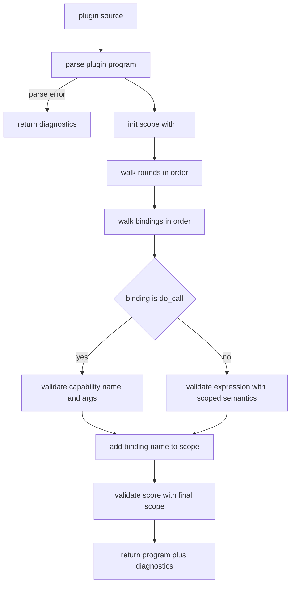

# Elo plugin validator plan

## Goal

Add a library-native plugin validation layer to [`elo/`](elo/) that catches both syntax and plugin-semantic issues, while preserving the current separation of responsibilities between [`parsePluginProgram()`](../elo/src/parser.ts:2126), generic expression compilation in [`transform()`](../elo/src/transform.js:49), and the app-side publisher in [`src/lib/features/elo-publisher/validator.ts`](../src/lib/features/elo-publisher/validator.ts).

## Architectural decision

Implement plugin validation in a dedicated module [`elo/src/plugin-validator.ts`](../elo/src/plugin-validator.ts), then re-export its public API from [`elo/src/embed.ts`](../elo/src/embed.ts).

This keeps the boundaries clear:

- [`elo/src/parser.ts`](../elo/src/parser.ts) owns plugin-program parsing
- [`elo/src/transform.ts`](../elo/src/transform.js:49) owns generic expression semantics
- [`elo/src/plugin-validator.ts`](../elo/src/plugin-validator.ts) owns plugin-only rules such as binding order, scope accumulation, and capability validation
- [`elo/src/embed.ts`](../elo/src/embed.ts) remains the main public façade

## Why this approach

### What is wrong today

- [`parsePluginProgram()`](../elo/src/parser.ts:2126) validates grammar only
- [`compilePlugin()`](../elo/src/embed.ts:66) validates only the score expression
- [`do_call`](../elo/src/ast.d.ts:11) is intentionally rejected by generic compilation, so plugin bindings never receive semantic validation
- unknown capability names such as `nost.query` currently pass parsing without any plugin-aware diagnostic
- app-side validation in [`src/lib/features/elo-publisher/validator.ts`](../src/lib/features/elo-publisher/validator.ts) cannot be the long-term source of truth

### Why this is the most consistent option

- no plugin logic leaks into the generic compiler
- no host-specific capability policy leaks into the parser
- all plugin validation rules live in one module
- the publisher UI can consume a stable library API instead of custom heuristics

## Target public API

Public exports should remain intentionally small.

### In [`elo/src/plugin-validator.ts`](../elo/src/plugin-validator.ts)

- [`PluginCapabilitySpec`](../elo/src/plugin-validator.ts)
- [`PluginValidationOptions`](../elo/src/plugin-validator.ts)
- [`PluginDiagnostic`](../elo/src/plugin-validator.ts)
- [`ValidatedPluginProgram`](../elo/src/plugin-validator.ts)
- [`validateExpressionAst()`](../elo/src/plugin-validator.ts)
- [`validatePluginProgram()`](../elo/src/plugin-validator.ts)

### Re-exported from [`elo/src/embed.ts`](../elo/src/embed.ts)

- [`validateExpressionAst()`](../elo/src/embed.ts)
- [`validatePluginProgram()`](../elo/src/embed.ts)

### Existing APIs that should stay strict

- [`compilePlugin()`](../elo/src/embed.ts:66) should remain fail-fast
- [`compileFromAst()`](../elo/src/embed.ts:43) should remain generic and unaware of plugin capability policy

## Proposed types

```ts
export type PluginCapabilitySpec = {
  name: string;
  validateArgs?: (argsExpr: Expr) => PluginDiagnostic[];
};

export type PluginValidationOptions = ParserOptions &
  JavaScriptCompileOptions & {
    allowedVariables?: Iterable<string>;
    capabilities?: Record<string, PluginCapabilitySpec>;
  };

export type PluginDiagnostic = Diagnostic & {
  phase?: "parse" | "binding" | "score" | "capability";
  roundIndex?: number;
  bindingName?: string;
};

export type ValidatedPluginProgram = {
  program: PluginProgram | null;
  diagnostics: PluginDiagnostic[];
  score?: JavaScriptCompileResult;
};
```

## Internal design

[`elo/src/plugin-validator.ts`](../elo/src/plugin-validator.ts) should contain:

- public API functions
- scope-aware plugin validation orchestration
- internal helpers for diagnostics and AST inspection

Suggested internal helpers:

- [`toDiagnostic()`](../elo/src/plugin-validator.ts)
- [`validateBindingExpr()`](../elo/src/plugin-validator.ts)
- [`validateDoCall()`](../elo/src/plugin-validator.ts)
- [`validateScoreExpr()`](../elo/src/plugin-validator.ts)
- [`buildScope()`](../elo/src/plugin-validator.ts)

## Validation flow



## Semantic rules to enforce

### Binding semantics

- each binding can reference `_`
- each binding can reference names defined earlier in the same round
- each binding can reference names defined in earlier rounds
- later bindings are not visible to earlier bindings unless you intentionally decide to support forward references

### Score semantics

- score expression can reference all validated binding names
- score expression must not contain [`do_call`](../elo/src/ast.d.ts:11)

### Capability semantics

- [`do_call`](../elo/src/ast.d.ts:11) is valid only inside round bindings
- unknown capability names produce diagnostics
- capability argument validation is delegated through [`PluginCapabilitySpec`](../elo/src/plugin-validator.ts)

### Generic expression semantics

Use the same semantic engine as the generic compiler, but with caller-provided scope. This should catch:

- undefined variables
- unknown function names
- invalid member access patterns
- invalid score typos such as `nul`

## Implementation sequence

### Phase 1: introduce validator primitives

1. Create [`elo/src/plugin-validator.ts`](../elo/src/plugin-validator.ts)
2. Add shared types for diagnostics and options
3. Add [`validateExpressionAst()`](../elo/src/plugin-validator.ts) backed by generic expression semantics and caller-provided scope

### Phase 2: add plugin-program validation

1. Parse via [`parsePluginProgram()`](../elo/src/parser.ts:2126)
2. Walk rounds and bindings in source order
3. Maintain accumulated scope
4. Validate score after bindings are processed
5. Return diagnostics instead of throwing

### Phase 3: capability-aware validation

1. Inspect [`do_call`](../elo/src/ast.d.ts:11) directly in plugin validation
2. Resolve capability names against the supplied registry
3. Invoke optional argument validators
4. Report diagnostics with `phase`, `roundIndex`, and `bindingName`

### Phase 4: public API integration

1. Re-export the new functions from [`elo/src/embed.ts`](../elo/src/embed.ts)
2. Leave [`compilePlugin()`](../elo/src/embed.ts:66) unchanged in behavior

### Phase 5: app integration

1. Replace ad hoc logic in [`src/lib/features/elo-publisher/validator.ts`](../src/lib/features/elo-publisher/validator.ts)
2. Update copy in [`src/routes/plugins/publisher/+page.svelte`](../src/routes/plugins/publisher/+page.svelte)
3. Keep the publisher app thin and library-driven

## Test plan

Add unit tests in [`elo/test/unit/plugin-program.unit.test.ts`](../elo/test/unit/plugin-program.unit.test.ts) for:

- valid plugin with `do 'nostr.query'`
- unknown function in a binding such as `Dat(...)`
- unknown variable in a binding
- unknown capability name such as `nost.query`
- invalid score identifier such as `nul`
- illegal [`do_call`](../elo/src/ast.d.ts:11) in score expression
- valid earlier-binding references
- invalid forward references if scope is sequential

## Non-goals

- do not teach the parser about concrete capability names
- do not move plugin validation into [`elo/src/transform.ts`](../elo/src/transform.js:49)
- do not make the publisher app the authority for plugin semantics
- do not broaden [`compilePlugin()`](../elo/src/embed.ts:66) into a diagnostic collector

## Expected outcome

After this iteration:

- [`@contextvm/elo`](../elo/package.json) provides a first-class plugin validation API
- plugin authors get diagnostics for both syntax and semantic mistakes
- the publisher page becomes a consumer of library truth, not a custom validator
- the codebase stays modular, with parser, compiler, plugin validation, and UI each owning a clear responsibility
